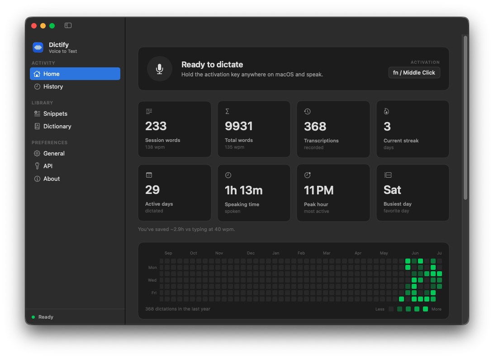
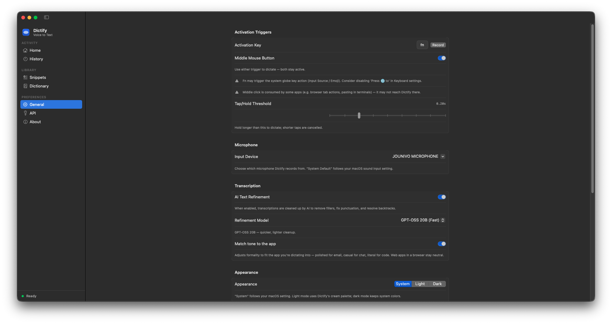
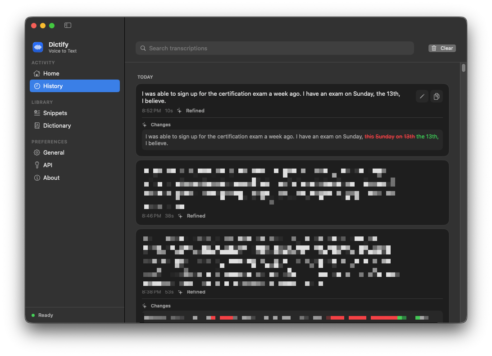
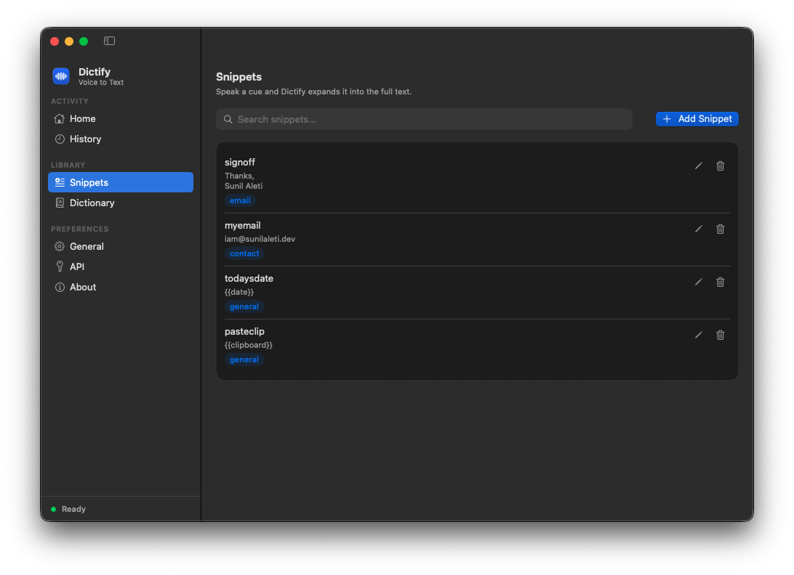
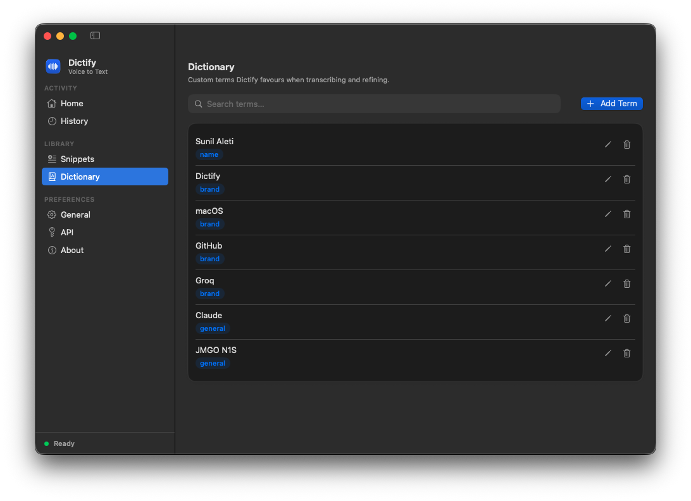
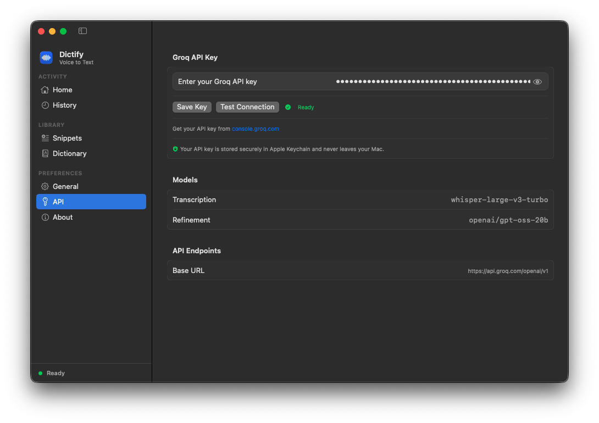
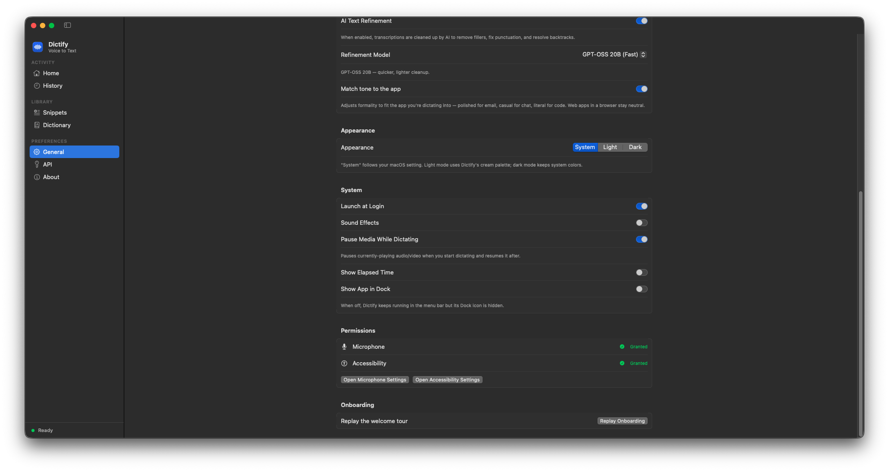

# Dictify

Hold `fn`, speak, get polished text anywhere on macOS.

Dictify is a native macOS app that turns speech into clean, punctuated text and inserts it directly into whatever app you're focused on. It uses Groq Whisper for transcription and Groq GPT-OSS to strip fillers, resolve backtracks, and auto-punctuate on the fly.




## Features

### Voice-activated dictation

Hold `fn` (or any shortcut you prefer) to record. Release to transcribe and insert. A minimal floating indicator at the bottom of the screen shows recording state and elapsed time - no windows to focus, no modes to switch. The audio engine is prewarmed at launch, so recording starts the instant you press the key.

[](https://youtu.be/uoDtB8owK8Q)

### AI refinement that matches where you're typing

Groq GPT-OSS cleans up what you actually said: removes "um" / "uh" / "like", resolves self-corrections ("meet at 2, actually 3" → "meet at 3"), and adds punctuation. Pick **Quality** (`openai/gpt-oss-120b`, best cleanup) or **Fast** (`openai/gpt-oss-20b`, lower latency).

With **Match tone to the app** on, Dictify locally classifies the writing context so the register fits - polished for email and docs, casual for chat, literal for code editors. Gmail and Outlook on the web are recognized from the active window, but raw window titles and message subjects are never sent to Groq.



### One home for everything

Home, history, dictionary, snippets, and settings all live in a single main window with a sidebar. The Home tab shows live stats - session and total words with words-per-minute, current streak, active days, total speaking time, peak hour, busiest day, an estimate of time saved versus typing, and a GitHub-style contribution graph of your daily activity. Close the window whenever you like; the global hotkey keeps working in the background, and a menu bar icon is always there for a quick reopen or quit.

### History with before/after diffs

Every dictation is saved locally, grouped by day, and searchable across both the raw and refined text. Click a refined entry to see exactly what the AI changed as a word-level diff, edit a transcription in place, or copy it with one click.



### Snippets with categories

Spoken triggers expand locally and deterministically to full text blocks. Organize them by category (email, contact, general, …) and use built-in variables like `{{date}}`, `{{time}}`, and `{{clipboard}}`; clipboard contents stay on your Mac.



### Personal dictionary

Teach Dictify your custom terms, names, brands, and acronyms, plus optional “heard as” aliases for recurring misrecognitions. Terms bias Whisper recognition, while aliases are corrected locally and deterministically before refinement.



### Bring your own Groq key

Paste your key once - Dictify stores it in the macOS Keychain and verifies it with a one-click **Test Connection**. The models in use are shown right in the API tab.



### The rest

- **Pause media while dictating** - currently-playing audio/video is paused when you start dictating and resumed after, so your music never bleeds into a recording.
- **Direct text insertion** - uses macOS Accessibility APIs to type into any text field; falls back to paste if a field is read-only.
- **Configurable activation** - choose `fn`, record any custom key/combo, or enable the middle-mouse button as an extra trigger. Adjust the tap-vs-hold threshold to taste.
- **Microphone selection** - pick which input device Dictify records from, or follow the system default.
- **Appearance** - follow the system look, or force Light (Dictify's cream palette) / Dark.
- **Diagnostics & log sharing** - something went wrong? Copy or email recent logs to the developer with one click. Logs are redacted - no API keys or dictated text are ever included.
- **Sound effects & visual feedback** - optional start/stop tones and an elapsed-time readout on the floating indicator.
- **Optional Dock presence** - run as a menu-bar-only app or show in the Dock, your call.
- **Launch at login** - one toggle, handled via `SMAppService`.
- **Guided onboarding** - first launch walks you through permissions; replay the welcome tour anytime from General settings.
- **Local-first storage** - dictionary, snippets, and history live on your Mac in `~/Library/Application Support/Dictify/`.
- **Keychain-encrypted API key** - your Groq API key never touches disk in plaintext.



## Requirements

- macOS 14 (Sonoma) or later
- A [Groq API key](https://console.groq.com/keys) - the free tier is enough for typical personal use
- **Microphone** and **Accessibility** permissions (Dictify walks you through granting both on first launch)

## Install

**Option 1 - Homebrew (recommended)**

```bash
brew tap aletisunil/tap
brew install --cask dictify
```

After tapping once, `brew install dictify` works too, and `brew upgrade --cask dictify` keeps it current.

**Option 2 - Download the signed DMG**

Grab the latest `Dictify.dmg` from the [Releases page](../../releases), drag the app to `/Applications`, and launch.

**Option 3 - Build from source**

Open `Dictify.xcodeproj` in Xcode and press ⌘R for the fastest feedback loop.

Or from the command line:

```bash
xcodebuild -project Dictify.xcodeproj -scheme Dictify -configuration Debug build
```

No code signing is needed for local development. The release pipeline (signing, notarization, DMG packaging) is automated in [`.github/workflows/release.yml`](.github/workflows/release.yml) and driven by the scripts in [`scripts/`](scripts/).

## Configuration

1. Launch Dictify - it walks you through granting Microphone + Accessibility permissions on first run.
2. Open the **API** tab, paste your Groq API key, and hit **Test Connection** to confirm. The key is stored in the macOS Keychain.
3. (Optional) Under **General**, pick your activation key, tap/hold threshold, refinement model, and whether the tone should match the app you're dictating into.
4. (Optional) Under **Dictionary**, add custom terms, names, or acronyms Dictify should bias toward.
5. (Optional) Under **Snippets**, create spoken triggers that expand to longer text.
6. Close the window (the app keeps running) and hold `fn` to start talking.

## Privacy

Dictify sends recorded audio only to [Groq's API](https://groq.com/privacy-policy/) for transcription and refinement. There is no analytics, no telemetry, and no other network traffic. The app ships a privacy manifest declaring exactly what system APIs it touches and why.

Your Groq API key is stored encrypted in the macOS Keychain. Your dictionary, snippets, and transcription history are stored as plain JSON under `~/Library/Application Support/Dictify/` - local to your Mac.

Diagnostic logs stay on your Mac unless you explicitly choose to share them, and are redacted to strip API keys and dictated text before they leave the app.

## License

[MIT](LICENSE) © Sunil Aleti
